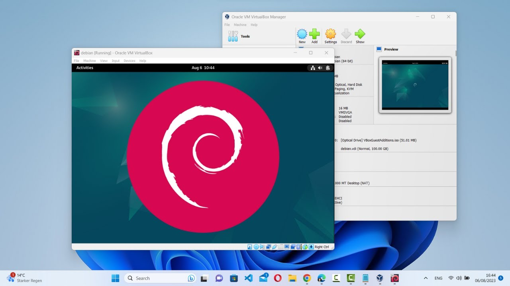

# Titre du projet : SAÉ 1.03 : Installation d'un poste  

## 1. Présentation du projet  

### Visuel attractif  

### Résumé du projet ou objectif principal  
L’objectif de ce projet était de :  
1. Créer une machine virtuelle (VM) en suivant un "TP libre".  
2. Rédiger une user notice en anglais pour guider un utilisateur dans la réalisation du même TP.  

Dans un premier temps, j’ai suivi les instructions du TP libre pour configurer une VM. Cela m’a permis de comprendre les principes fondamentaux de la virtualisation et d’apprendre à manipuler les outils nécessaires.  

Par la suite, j’ai élaboré une notice utilisateur en anglais. Ce document explique, étape par étape, comment créer une VM de manière simple et claire. La rédaction en anglais a ajouté une dimension internationale au projet, permettant à un public plus large de comprendre et d’appliquer les instructions.  

### Compétences techniques et savoir-faire informatiques visés par le projet :  
- Créer et configurer une machine virtuelle à l’aide d’un outil de virtualisation.  
- Rédiger une notice utilisateur en anglais.  
- Résoudre des problèmes techniques liés à la configuration des VM.  
- Approfondir les concepts de base de la virtualisation et leur application.  

### Livrables liés à l’informatique :  
- Document ou lien vers la preuve : *[Tp libre](https://github.com/Aksel-B/univ-lille/BUT-1/S1/SAE-1.03/tp-libre.pdf)*  

### Livrables différents du domaine de l’informatique :  
- Document ou lien vers la ou les preuves : *[User notice](https://github.com/Aksel-B/univ-lille/BUT-1/S1/SAE-1.03/user-notice.pdf)*  

### Savoir-être requis :  
- **Autonomie**, pour comprendre et exécuter le TP en anglais.  
- **Précision**, pour détailler les étapes dans une langue étrangère de manière claire et compréhensible.  

### Savoir-faire autres qu’informatique :  
- Rédaction en anglais pour un public non francophone.  
- Vulgarisation des étapes techniques pour les rendre accessibles.  

---

## 2. Mon Bilan Personnel  

### Mes points forts :  
- J’ai rapidement appris à configurer une VM en suivant un TP technique en anglais.  
- La rédaction de la user notice m’a permis de consolider mes compétences en communication technique en anglais.  
- J’ai démontré une bonne capacité à résoudre les problèmes techniques rencontrés.  

### Mes difficultés dans la mise en œuvre du projet :  
- Rédiger en anglais m’a demandé plus de temps que prévu pour m’assurer que les consignes étaient claires et correctes.  
- Certaines étapes techniques du TP étaient complexes et nécessitaient des recherches supplémentaires.  

### Mes points à améliorer :  
- Améliorer mon vocabulaire technique en anglais pour faciliter la rédaction future de documents similaires.  
- Développer une méthode plus efficace pour structurer les documents pédagogiques.  

### Conclusion :  
Ce projet m’a permis de renforcer mes compétences techniques en virtualisation et en rédaction technique en anglais.  

Si c’était à refaire, je consacrerais plus de temps à planifier et structurer la rédaction de la notice.  

Pour le BUT 2, mes objectifs sont de :  
- Consolider mes compétences en virtualisation.  
- Améliorer ma maîtrise de l’anglais technique, à l’écrit comme à l’oral.  

Cette SAE m’a également sensibilisé à l’importance de l’anglais dans la communication technique et les projets informatiques à vocation internationale.  
